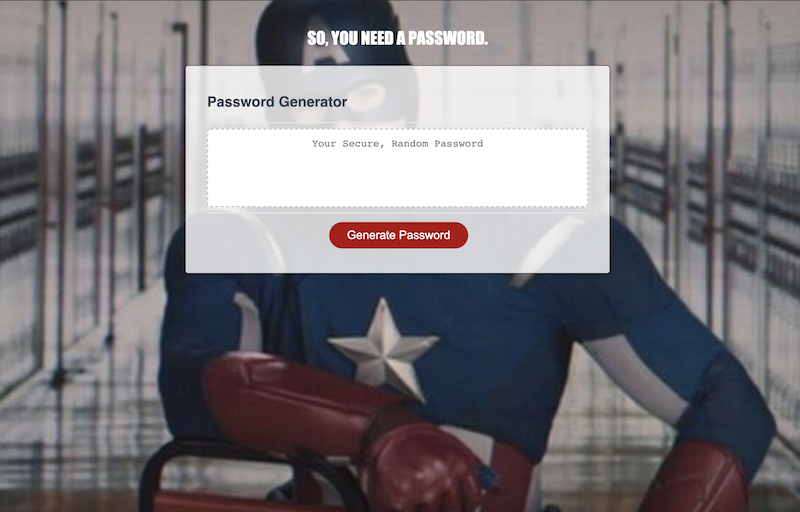

# Random Password Generator

This is a password generator application which allows a user to randomly generate a password of the user's desired length. The application asks the user what types of characters the user would like to include in the password and will generate a password randomly based on the selected criteria.

## Technologies Used
* HTML
* CSS
* JavaScript

## Screenshots

 
Screenshot of application before password is generated.

 

 
Gif of random password being populated (alerts not shown).

 

## Deployed link
The deployed application can be found [here](https://maynperalta.github.io/PasswordGenerator/)

## Contact information
I can be contacted via email at <maynperalta@gmail.com>